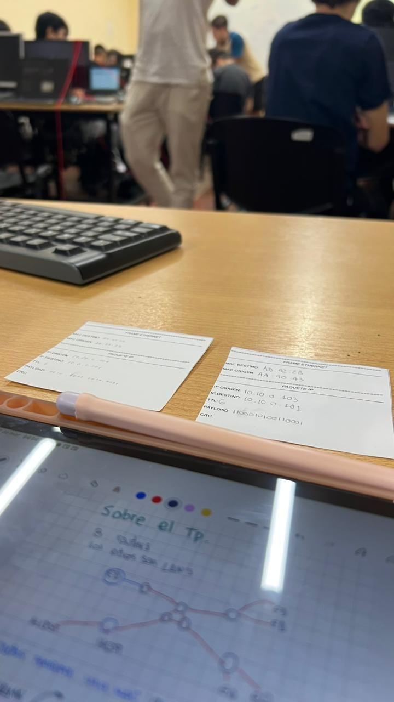
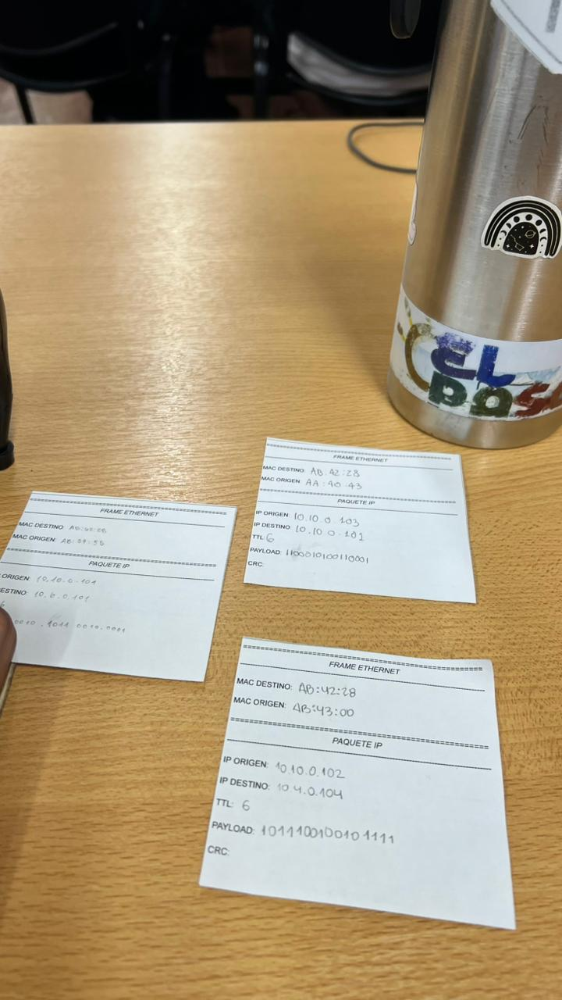
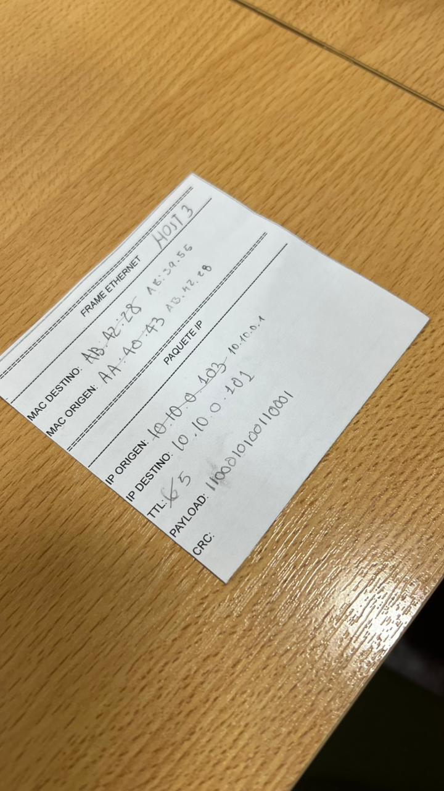
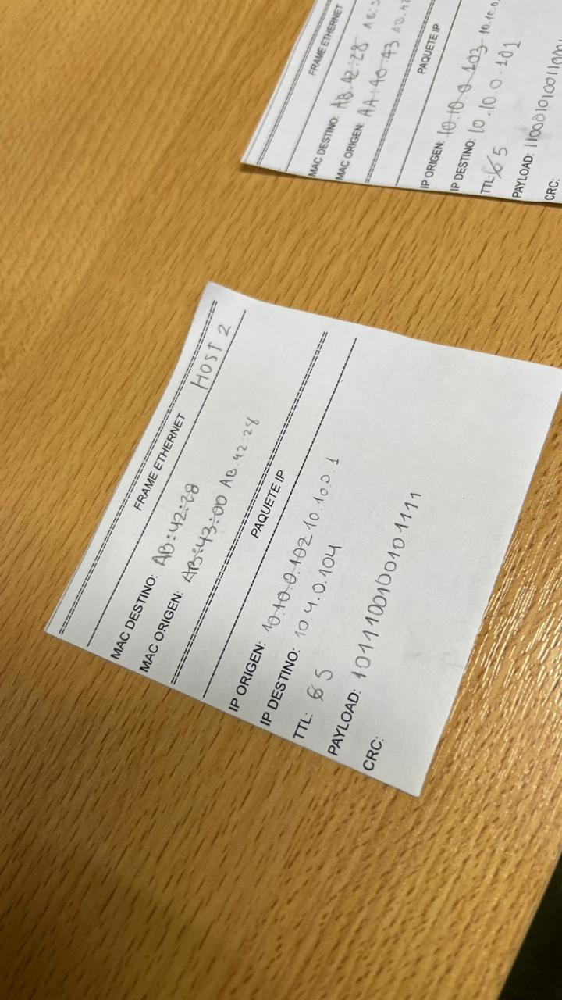
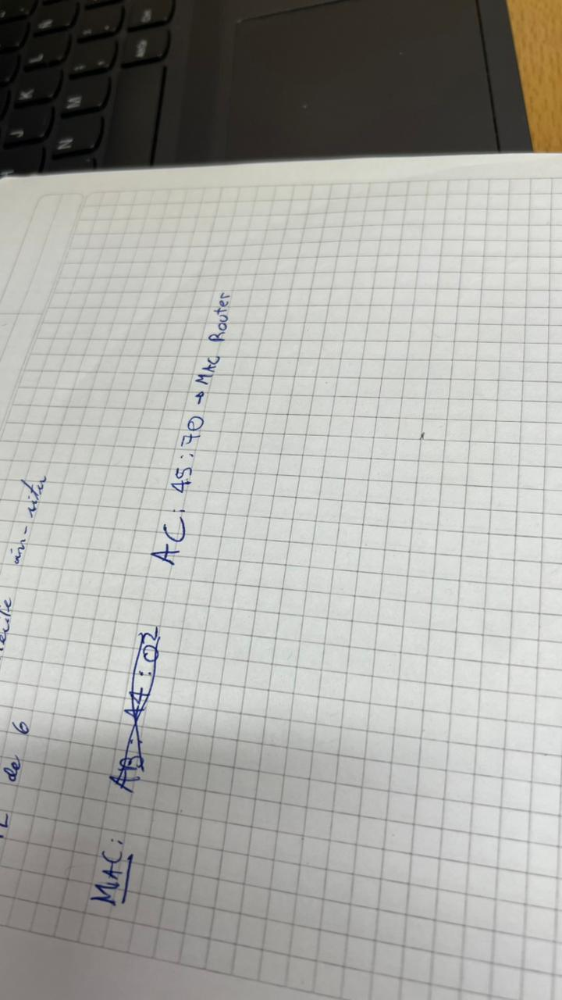
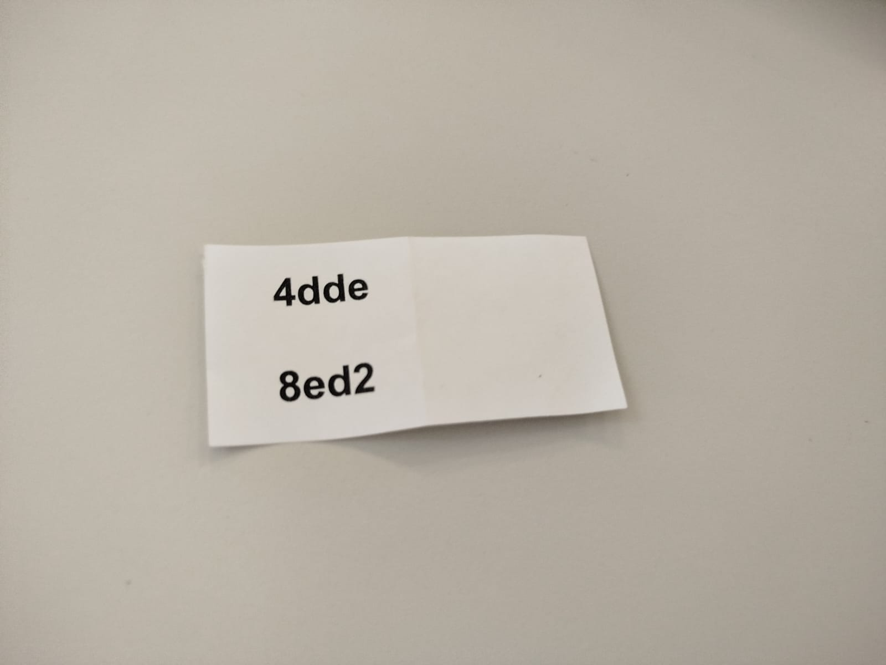
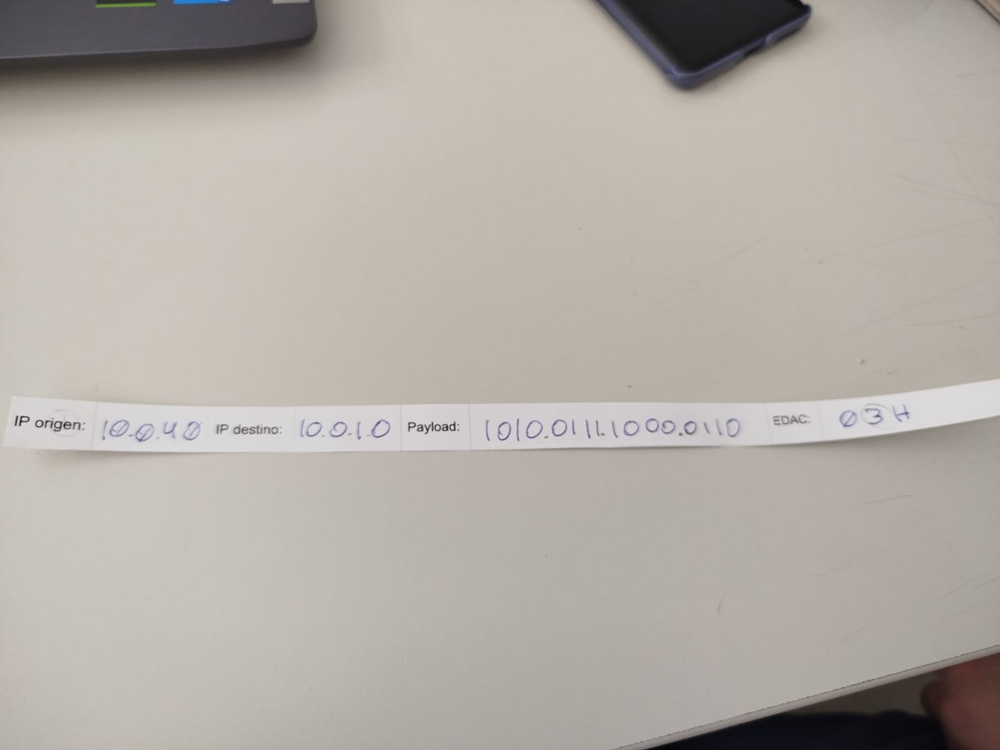

# Redes de Computadoras
## Trabajo Practico N°1
### Grupo: Frame Moggers
### Integrantes
* **Bejarano, Kevin**
* **Bustos, Hugo**
* **Gonzalez, Macarena**
* **Nieto, Marcos**

### Desarrollo
#### Primera Parte
#### Repaso general didáctico: Simulación de envío de     paquetes, ARP y ruteo entre redes.
**1)** 
Una NIC es un componente de hardware que opera en las capas físicas y de enlace. En nuestro caso, somos 4 integrantes en el grupo en el cual 3 son Dispositivos Finales y 1 es el Router. Ya que no tenemos "NICs" se simulan asignandonos valores de MAC.

Las tablas con los datos de los Dispositivos finales es la siguiente:

| Host | MAC | DST1 | Payload | IP |
| :--- | :--- | :--- | :---| :---|
| Host 1 | AB:39:55 | 10.6.0.101 | 2b21 | 10.10.0.101 |
| Host 2 | AB:43:00 | 10.4.0.104 | b92f | 10.10.0.102 |
| Host 3 | AA:40:43 | 10.10.0.101| c531 | 10.10.0.103 |

Para el caso del Router, su tabla es: 

| Router | MAC | IP |
| :--- | :--- | :--- | 
| Default Gateway | AB:42:28 | 10.10.0.1 |

**2)** 
En la actividad practica que tuvimos, los distintos grupos fuimos divididos o separados en diferentes nodos que estaban conectados de una determinada manera. Se decidió que 3 grupos iban a representar los routers que interactuan con el mundo exterior, mientras que cada grupo debia tener obligatoriamente su default gateway que estaba conectado a uno de esos 3 routers. 

La red que se habia armado es la que se muestra en la tablet, donde eramos parte de un grupo que era dispositivos finales.

**3)** 
Esta es la conformacion de paquetes de nuestro grupo de parte de los 3 hosts.

Para realizar estos paquetes, cada uno de los hosts teniamos asignadas diversas direcciones IP (dependiendo del default gateway) y ademas teniamos destinos asignados.

Tambien se puede observar que todos los paquetes estaban dirigidos hacia la misma direccion MAC fisica que es la AA:42:28, esta direccion es la direccion fisica del default gateway.

**4)** 
En nuestro caso lo que nos sucedió esque uno de los host tenia asignada la direccion para el envio de datos hacia otro de nuestros host. Esto lo puede resolver el default gateway sin necesidad de salir de la red local.

El trabajo que debe hacer es recibir el paquete, disminuir el TTL en una unidad y luego verificar con la submascara de red si el destino del paquete es local o debe ir hacia afuera de la red. 

Para los otros casos, todos los paquetes de los host fueron enviados al default gateway que lo que tenia que hacer era modificar la IP de origen, la mac de origen y de destino y posterior a esto enviarlo hacia el router que esta en el exterior. 

En la practica, pudimos enviar todos los paquetes pero no recibimos ningun paquete desde el exterior hacia nuestros host.

Dado que uno de los destinos de un hosts de nuestra red era otro host, entonces el default gateway se puede encargar solo ruteando el paquete a la direccion IP adecuada. 

En la imagen se observa como fue decrementado el metadato de TTL, y como cambió la MAC de origen y la de destino.

A continuacion mostramos la otra imagen que indica el paquete de uno de los hosts que tenia de destino una IP de una red que estaba fuera de la local. En este caso el default gateway disminuyó el TTL y ademas cambió la direccion IP de origen y de destino hacia la que conocia del router central.

En la imagen todavia no conociamos el nombre de la MAC de destino, pero luego de acercarnos al grupo y preguntar pudimos obtenerla. En esta imagen mostramos cual era esa MAC

**5)** 
Esta práctica de simulación física resultó fundamental para repasar/entender los conceptos teóricos de la arquitectura de redes al plano tangible. Si bien la teoría del modelo OSI es clara, realizar el proceso hop-by-hop manualmente nos permitió dimensionar la complejidad de las decisiones que toma un router en milisegundos. Queremos destacar especialmente el análisis de la encapsulación y desencapsulación de paquetes en cada salto asi como tambien la utilización de la mascara de subred para discriminar el trafico local del trafico remoto.

* **a)** 
    Este fenómeno ocurre debido a la naturaleza del modelo de entrega hop-by-hop (salto a salto) que utilizan los routers para mover información a través de redes interconectadas. Sabiendo esto, el motivo por el cual la dirección IP de destino permanece constante mientras la dirección MAC cambia en cada salto es por la distinción fundamental entre el direccionamiento de extremo a extremo y la entrega física local. 

    La dirección IP funciona como un identificador lógico global que representa el destino final del paquete, por lo que debe mantenerse fija durante todo el trayecto para que cualquier dispositivo intermedio sepa hacia dónde encaminar la información. 

    Por el contrario, la dirección MAC es un identificador físico vinculado al hardware que solo tiene validez dentro de un mismo segmento de red o enlace de datos. 

    Cada vez que un paquete atraviesa un router, este realiza un proceso de desencapsulación y reencapsulación, basicamente el router abre el frame Ethernet entrante para leer la cabecera IP, consulta su tabla de ruteo para decidir el siguiente salto y despues construye un frame Ethernet completamente nuevo para ese tramo específico del viaje. 

    En este nuevo frame, la MAC de destino se actualiza para apuntar al siguiente nodo físico (next hop) o al host final, lo que demuestra que mientras el direccionamiento lógico (IP) permite la conectividad global y el ruteo a través de diversas redes, el direccionamiento físico (MAC) se encarga estrictamente del transporte de los bits entre dos dispositivos adyacentes que comparten un mismo medio físico.

* **b)**
    Se utiliza este mecanismo porque el host de origen solo tiene visibilidad de su propia red local y no tiene una tabla de ruteo o otro mecanismo para poder conocer el camino hacia el exterior.

    El host de origen no puede obtener la dirección física (MAC) de un dispositivo que no se encuentra en la misma red local. El gateway actua como un intermediario entre las diferentes redes permitiendo que el paquete llegue a su destino. Es importante recordar que el default gateway no conoce el camino directo hasta el destino, sino que conoce a una cantidad limitada de routers a los cuales les pregunta si ellos conocen la direccion de destino y asi sucesivamente hasta encontrarla.

* **c)**
    Este modelo de Hop-by-Hop evita que cada nodo deba procesar y almacenar la topologia completa de toda la red de Internet, lo cual al dia de hoy seria computacionalmente imposible. En su lugar, el router solo gestiona prefijos de red y el siguiente salto inmediato, optimizando totalmente el uso de la memoria y CPU. 

    Esta arquitectura tiene la ventaja de que si un enlace intermedio falla, cada router puede desviar el trafico de forma autónoma hacia otras rutas sin necesidad de que el host de origen reconfigure algo del paquete. De esta manera, el ruteo hop-by-hop permite la existencia de multiples administradores de red, simplificando la conectividad de extremo a extremo.

* **d)**
    La reconstrucción del frame es indispensable porque los encabezados de Ethernet están diseñados exclusivamente para el transporte dentro del enlace físico inmediato. Cada vez que un paquete llega a un router, se debe examinar la dirección IP de destino en la Capa 3 para determinar el camino a seguir. 
    
    Una vez decidido el siguiente salto, el router genera un nuevo frame con su propia dirección MAC como origen y la dirección MAC del siguiente dispositivo (ya sea otro router o el host final) como destino. Si los routers intentaran reenviar exactamente el mismo frame sin modificarlo, el paquete quedaría atrapado en el segmento original: las direcciones MAC de la trama original no tendrian sentido o validez en el nuevo enlace, y el siguiente dispositivo en la ruta lo descartaría de inmediato al notar que la dirección física de destino no coincide con la suya. 
    
    Tambien investigamos que, gracias a este proceso de reencapsulación, hacemos que la red sea mas flexible ya que podemos permitir que un paquete IP viaje a través de diferentes medios físicos, como pasar de una conexión de fibra óptica a una de cobre, adaptando el exterior a los requisitos técnicos de cada cable o interfaz. 

* **e)**
    El campo TTL (Time To Live) funciona como un mecanismo de seguridad de la Capa 3 que previene la persistencia infinita de paquetes dentro de una infraestructura en caso de existir bucles de ruteo. Estos bucles, son causados generalmente por inconsistencias en las tablas de ruteo locales de los dispositivos intermedios, podrían forzar a los paquetes a circular de manera perpetua entre nodos. 
    
    Al decrementarse obligatoriamente en una unidad en cada router que atraviesa, el TTL asegura que la información tenga una vida útil finita; una vez que el valor alcanza el cero, el paquete es descartado automáticamente por el dispositivo que lo posee. Si este mecanismo no existiera, cualquier error de configuración generaría una acumulación exponencial de tráfico "fantasma" que nunca llegaría a su destino, consumiendo el ancho de banda y saturando la capacidad de procesamiento de los routers. 
    
    Esto provocaría eventualmente un colapso total de la red, ya que los recursos se agotarían en el transporte de datos obsoletos, impidiendo la transmisión de tráfico legítimo

#### Segunda parte
#### Inyección y detección de errores
Para comenzar con esta parte, a los 4 grupos presentes, se nos asignó una dirección IP para poder comunicarnos entre nosotros.
Luego se explicó las maneras de asegurar la integridad de un paquete, descartando el HASH ya que agrega demasiados datos siendo mas grande que el  PAYLOAD a transmitir. 

Las técnicas explicadas en clase fueron XOR y BIT DE PARIDAD. 
La técnica XOR consiste en aplicar la operación XOR con cada NIBBLE desde el MSB hasta completar todo el PAYLOAD, obteniendo un NIBBLE como resultado final que se almacena en el METADATA.  

En la técnica de BIT DE PARIDAD  se cuentan las cantidades de 1 por cada NIBBLE, si la  cantidad  es PAR el resultado es  un  0 y si la cantidad es IMPAR el resultado es un 1 obteniendo un NIBBLE final en este caso ya que el PAYLOAD es de 2 bytes.

Los datos asignados a nuestro grupo fueron:

 <b> PAQUETE A ENVIAR </b> 

IP de origen: 10.0.1.0
IP de destino: 10.0.3.0
Técnica: XOR
PAYLOAD: 4dd4 (0100 1101 1101 1110)
EDAC: 1010

 
 <b> PAQUETE RECIBIDO </b> 

IP de origen: 10.0.4.0
IP de destino: 10.0.1.0
Técnica: BIT DE PARIDAD
PAYLOAD: 1010 0111 1000 0110 
EDAC: 03H ->0000 0011  

Si aplicamos la técnica de paridad en el PAYLOAD el resultado es: 0110 el cual no coincide con lo enviado por lo tanto el paquete fue modificado. 

