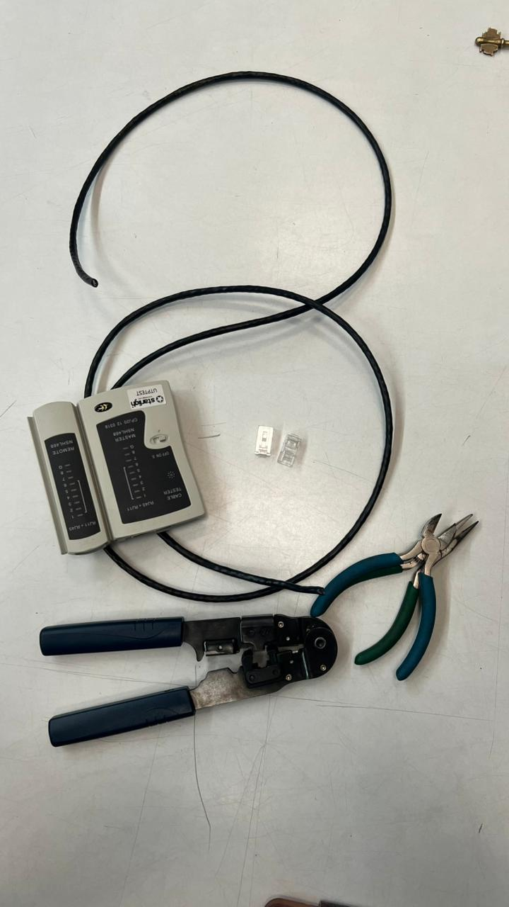
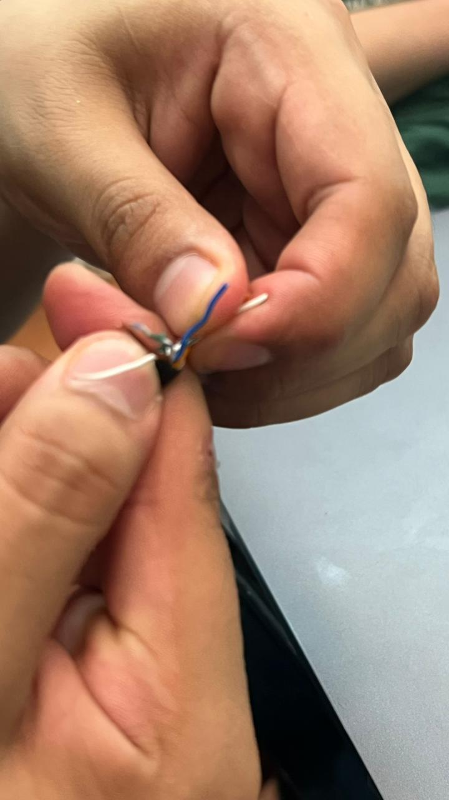
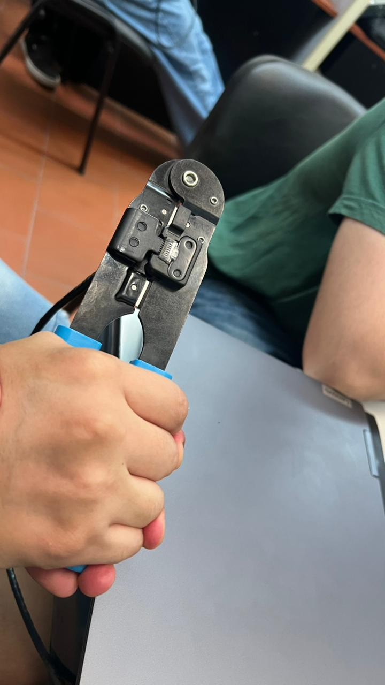
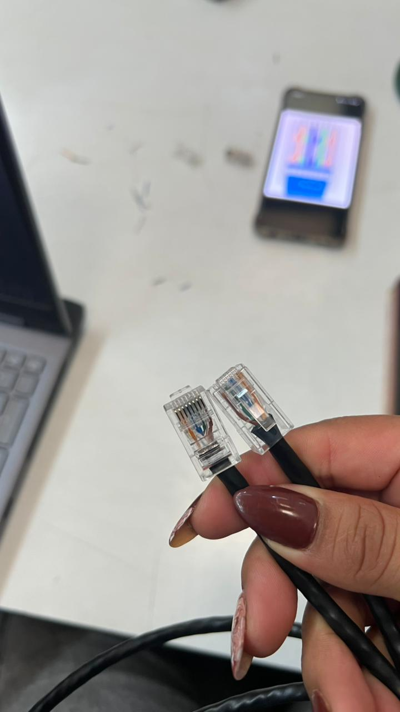
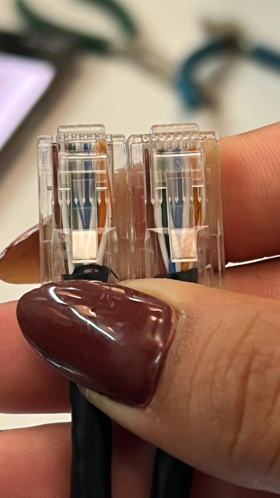

# Redes de Computadoras

## Trabajo Practico N°2

### Grupo: Frame Moggers

### Integrantes

* **Bejarano, Kevin**
* **Bustos, Hugo Gabriel**
* **Gonzalez, Macarena**
* **Nieto, Marcos**

### Desarrollo

#### Parte 1: Armado y verificación de cables Cat5/Cat5e bajo estándar T568A/B.

##### 1)

La utilización de un cable directo o cruzado dependerá del tipo de conexión que se necesite. Para normalizar la disposición de cables, se utilizan dos estándares, el T568A y T568B, los cuales proporcionan esquemas de cableado para la terminación de los cables de red en enchufes, así como enchufes RJ45 de ocho posiciones.  

Un cable de red directo es un tipo de cable de par trenzado que se usa en las redes de área local para conectar un ordenador a un núcleo de red como por ejemplo un enrutador. Este tipo de cable también se conoce como cable de conexión y es una alternativa a las conexiones inalámbricas donde uno o más ordenadores acceden a un enrutador a través de una señal inalámbrica.  

Los pasos que utilizamos para crimpear el cable fueron:  

1. Medir la longitud deseada para nuestro cable y realizar el corte del mismo
2. Proceder a quitar el recubrimiento plasticlo del cable para dejar expuesto los pares trenzados del mismo
3. Separar los cables en el orden necesario segun la norma a utilizar
4. Introducir los cables previamente ordenados en el plug RJ45
5. Con el cable ya en el interior del RJ45 se procede a crimpear utilizando la herramienta.


##### 2)

Se adjuntan imagenes que verifican el armado del cable.





Como resultado final adjuntamos nuestro cable:


##### 3 y 4)

El grupo con el que intercambiamos nos dió este cable:


Luego de inspeccionarlo con detalle llegamos a la siguiente conclusion:

- Los conductores no están completamente insertados
- Antes de entrar al conector, los pares están demasiado separados.
- La cubierta negra del cable debería entrar dentro del RJ45 para que la prensa del conector la sujete.

#### Parte 2: Equipamiento físico, verificación y utilización de equipos de red y análisis de tráfico.

##### 2)
###### Conexión con PuTTY:

1. Conectamos el cable RJ45 al puerto Consola del switch Cisco. La otra punta la conectamos a un adaptador RJ45 a USB, que a su vez conectamos a la computadora. 
2. Abrimos PuTTY.
3. Elegimos "Serial" como Tipo de Conexión.
4. Establecemos la Velocidad (Baudios) en 9600.
5. Al abrirse la terminal, apretamos Enter para activar el prompt.

###### Acceso a opciones de administración y modificación de clave:

1. Al acceder, estamos en modo usuario. Ejecutamos el comando `enable` para entrar en modo privilegiado.
2. Ingresar contraseña, si está configurada.
3. Ejecutar el comando `configure terminal` para entrar en modo de configuración global.
4. Para configurar la contraseña de modo privilegiado: `enable secret nueva_contraseña`.
5. Para configurar la clave del puerto consola:
        ```
        line con 0
        password contraseña
        login
        exit
        ```
6. Para guardar la configuración, ejecutamos `copy running-config startup-config`

###### Conexión de computadoras al switch. Configuración de red. Testeo de conectividad.

1. Conectar con cables RJ-45 directos el puerto de red de las computadoras y algún puerto del switch. Ej: FastEthernet 0/1
2. El switch no es un router. No asigna IPs. En cada PC, debemos poner IPs fijas:
    1. En Windows: Panel de Control > Centro de redes > Cambiar configuración del adaptador.
    2. Clic derecho en "Ethernet" > Propiedades.
    3. Protocolo de Internet versión 4 (TCP/IPv4) > Propiedades.
    4. En "Usar la siguiente dirección IP" ponemos, por ejemplo: IP 192.168.1.10 Máscara 255.255.255.0
3. Se puede probar la conectividad usando ping desde una computadora hacia otra. Por ejemplo podemos hacer ping desde una computadora hacia la que configuramos en *2.4* usando cmd para ejecutar el comando `ping 192.168.1.10`.
    1. Si recibimos respuesta, la conexión fue establecida correctamente.
    2. Si recibimos un timeout o se nos dice "Host de destino innacesible", la conexión falló.
        1. En este caso, debemos verificar si todos los hosts están conectados a la misma VLAN (VLAN 1, por defecto), y que el firewall no esté causando problemas.
