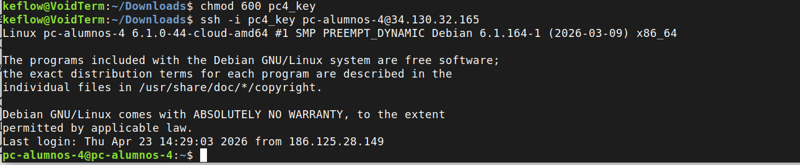
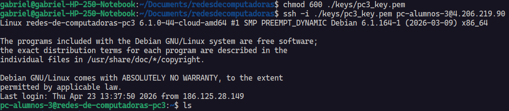
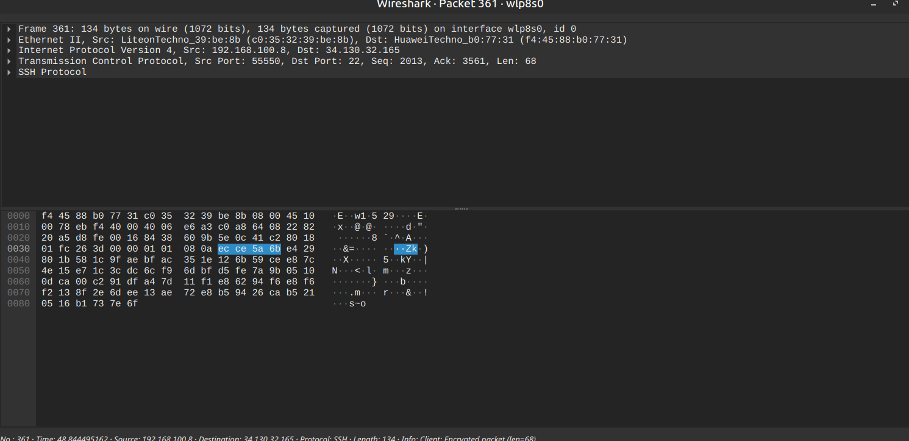

# Redes de Computadoras

## Trabajo Practico N°3

### Grupo: Frame Moggers

### Integrantes

* **Bejarano, Kevin**
* **Bustos, Hugo Gabriel**
* **Gonzalez, Macarena**
* **Nieto, Marcos**
### Consignas
1) Investigación conceptual (respuestas breves). Responder en forma concisa.

    - a)​ ¿Qué es SSH y qué problema resuelve?

    - b)​ Diferencia entre autenticación y cifrado

    - c)​ ¿Qué es una clave pública y una clave privada?

    - d)​ ¿Por qué la clave privada no debe compartirse?

    - e)​ ¿Qué ventajas tienen las claves SSH frente a contraseñas?

2) Verificar conexión SSH con alguna de las VMs que reservaron. Documentar su paso por la VM creando una carpeta con el nombre de su grupo.

```bash
ssh -i <path/a/la/clave> <usuario>@<ip>
```

3) Usando Wireshark, capturar tráfico SSH y analizar alguno de los paquetes. ¿Podés descifrar el contenido?

4) Nuestras VMs (virtual machines) están corriendo un SO Debian en una arquitectura x64. Vamos a utilizar netcat para desplegar servidores simples y capturar tráfico. Instalar netcat en la VM si no está instalado (sudo apt install ncat) y en sus computadoras locales. Luego:
    - a)​ Montar un servidor TCP en alguno de los puertos habilitados en la VM. 
        ```bash
        ncat -l <puerto>
        ```
        Configurar nuestro wireshark para escuchar conexiones TCP no SSH hacia la VM (filtro ip.dst == <VM_IP> and !ssh). Conectar nuestra computadora (LOCAL). 
        ```bash
        ncat <VM_IP> <PUERTO>
        ```
        Y capturar el handshake TCP en wireshark. Luego, enviar mensajes entre su computadora local y la VM en la nube, capturar y analizar los mensajes con wireshark. ¿Podés descifrar el contenido?

    - b)​ Repetir el punto anterior pero utilizando protocolo UDP (investigar cómo enviar tráfico UDP con netcat).

    - c)​ Conectarse a otra VM (mantener dos sesiones en dos terminales distintas) y establecer conexión con netcat entre ellas. Documentar un ida y vuelta de frases al estilo chat entre las instancias.

5) Navegar a la carpeta de su grupo (la que crearon en el ítem 2). Crear un archivo index.html dentro con un mensaje dentro al estilo “Hola Mundo”. Pero sean más creativos... Luego, desplieguen un servidor HTTP:​
    ```bash
    python3 -m http.server 8000
    ```

    Ingresen desde su PC local al navegador: http://<VM_IP>:<PUERTO> y comprobar el acceso.

    Capturen el tráfico HTTP con wireshark. ¿Pueden descifrar el contenido? ¿Podrían intervenir el contenido?

6) Ver el siguiente video de Veritasium en YouTube: https://www.youtube.com/watch?v=PPJ6NJkmDAo
    - a)​ Relacionar el problema que aborda el video con los TPs 1), 2) y 3). ¿Qué cosas que hemos aprendido
    se aplican directamente al problema demostrado?

    - b)​ ¿Qué cosas deberíamos tener en cuenta dado el principio de confidencialidad en las redes de
    computadoras y los resultados obtenidos en este laboratorio?
### Desarrollo

#### 1) Investigación conceptual.

1. SSH es un protocolo de red criptográfico. Proporciona servicios de autenticación y cifrado de mensajes. Soluciona el problema de cómo mantener una conexión segura en una red no confiable. Se diferencia en ésto de telnet, donde los datos se transfieren en texto plano.

2. Autenticación refiere al proceso de verificar la identidad de cada una de las partes involucradas en la comunicación. Encriptación es el proceso por el cual los mensajes enviados por la red son cifrados a propósito de mantener su confidencialidad.

3. Son los elementos claves de la criptografía asimétrica. Permiten cifrar datos y verificar identidades. Un usuario crea un par de llaves relacionadas, una pública, la otra privada. 
    **Criptografía:** Si Anabel quiere comunicarse de forma segura con Bartolomeo, encripta el mensaje a enviar con la clave pública de éste último. Bartolomeo usa entonces su clave privada para descifrar el mensaje.  
    **Autentificación:** Si Bartolomeo quiere demostrar que es el remitente de un mensaje, lo firma con su clave privada. Cualquiera puede entonces verificar la firma usando la clave pública de Bartolomeo.

4. En adición a poder descifrar cualquier mensaje seguro del que seamos destinatarios, un agente malicioso puede usar nuestra clave privada para mandar mensajes como si fueramos su remitente.

5. Las claves SSH son prácticamente imposibles de forzar, comparadas con las contraseñas generadas por humanos. Eliminan riesgos como la intercepción de contraseñas, ya que la clave privada nunca se envía al servidor. Ganan en conveniencia también, permitiendo log-ins sin contraseña y el uso de scripts para aplicaciones como interacciones automáticas con servidores, etc.

#### 2) Conexion SSH
Para la práctica, nuestro grupo reservó las máquinas virtuales PC 3 y PC 4. En las capturas se puede ver el proceso que seguimos para entrar a la PC 3 y 4, donde nos topamos con un detalle de seguridad fundamental antes de poder conectar.

Cuando descargamos la llave privada (pc4_key), el sistema suele asignarle permisos por defecto que son "demasiado abiertos" (permiten que otros usuarios la lean). Averiguamos que el protocolo SSH es muy estricto con esto: si la llave no es privada al 100%, la conexión se rechaza por seguridad.

Por eso, lo primero que hicimos fue ejecutar:
```bash
chmod 600 pc4_key
```

Con este comando le decimos al SO que solo nosotros (el dueño del archivo) podemos leerlo y escribirlo. Sin este comando, al intentar el SSH, la terminal nos daría un error diciendo que la llave "está desprotegida" y no nos dejaría entrar (como nos pasó).

Una vez que la llave tuvo los permisos correctos, usamos el comando ssh con el parámetro -i (de identity file) para indicarle qué llave usar:
```bash
ssh -i pc4_key pc-alumnos-4@34.130.32.165
```



Como se ve en la imagen, logramos entrar exitosamente a la instancia Debian. El sistema nos recibió con el mensaje de bienvenida y el prompt cambió a **pc-alumnos-4@pc-alumnos-4**, confirmando que ya estábamos operando dentro de la VM asignada.

#### 3) Capturar trafico SSH
Una vez conectados, usamos Wireshark para capturar el tráfico entre nuestra PC y la VM para ver si podíamos leer lo que enviábamos.




Al filtrar por la IP de destino, vimos que los paquetes aparecen etiquetados como SSH. Cuando intentamos inspeccionar el contenido de un paquete (el payload), solo encontramos valores hexadecimales y caracteres sin sentido.

Esto pasa porque SSH cifra toda la comunicación después del saludo inicial. Confirmamos que, aunque interceptemos el tráfico, no es posible descifrar el contenido ni ver los comandos que estamos ejecutando sin las claves de cifrado que se negociaron al conectar. Solo vemos "datos encriptados" como se muestra en las capturas.

Con estas imagenes confirmamos que la conexión es segura. Aunque capturamos el tráfico con éxito, el protocolo cumple su función de mantener la confidencialidad de los datos, haciendo que sea imposible leer el contenido de los paquetes sin las claves criptográficas correspondientes.