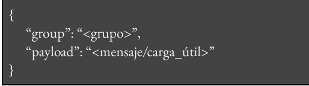
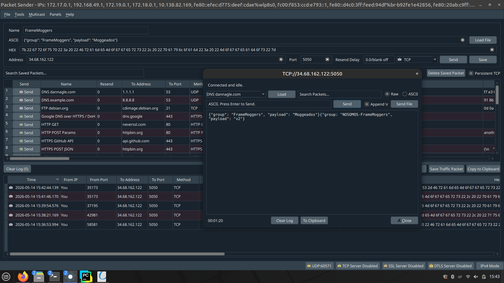
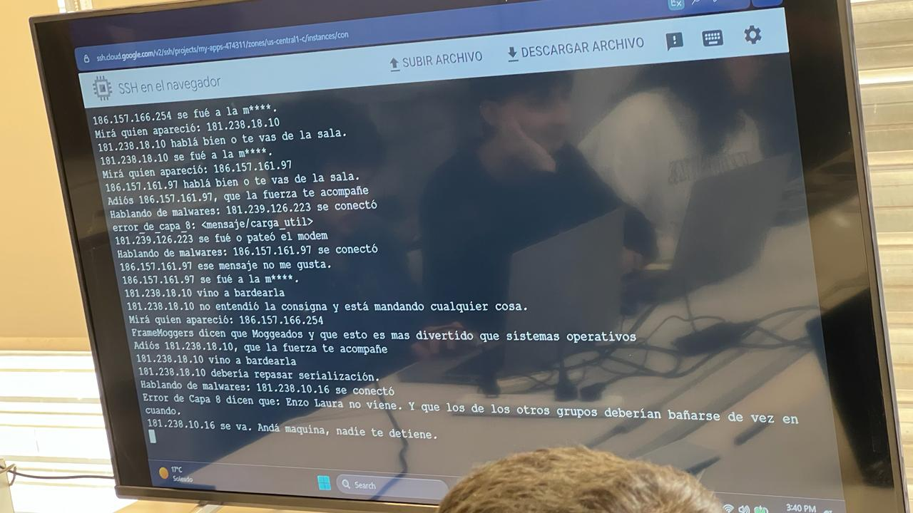
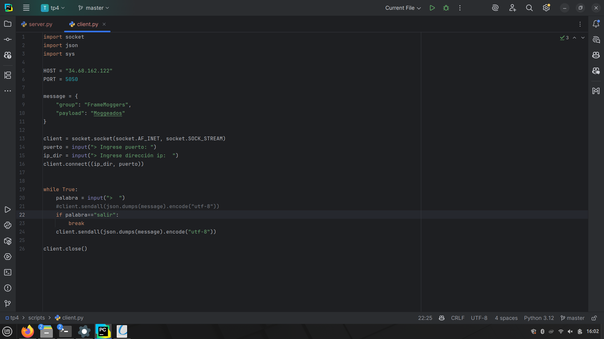
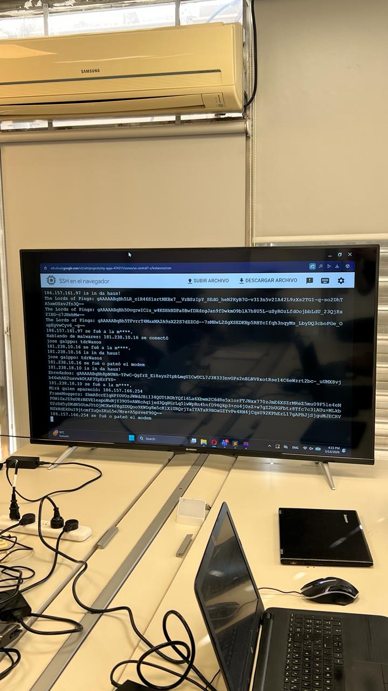
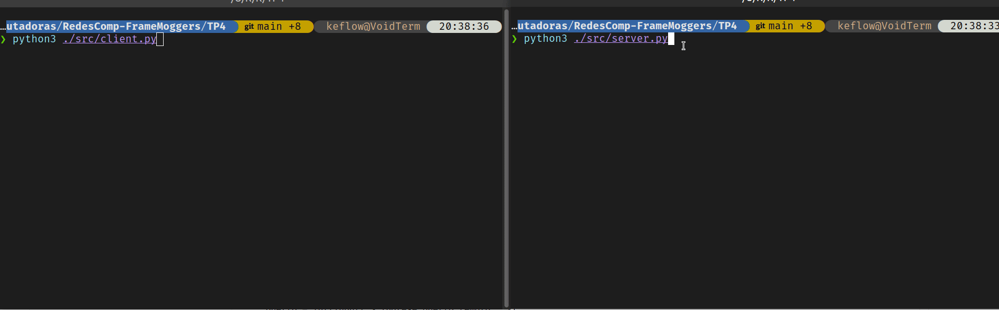

# Redes de Computadoras

## Trabajo Practico N°4

### Grupo: Frame Moggers

### Integrantes

* **Bejarano, Kevin**
* **Bustos, Hugo Gabriel**
* **Gonzalez, Macarena**
* **Nieto, Marcos**
### Consignas
1) Sabemos que la información viaja a través de internet “empaquetada” según el protocolo de capa de transporte que utilicemos. Sin embargo, dentro de la carga útil de estos paquetes, la información debe estar organizada para poder realizar una interpretación correcta de su significado.

    - a)​ ¿Qué es la serialización en redes de computadoras?

    - b)​ ¿Cuál es la diferencia entre serialización binaria y no binaria? Buscar ejemplos, ventajas y desventajas de cada una.


2) Desplegaremos un servidor TCP multi-hilo:​
    - Si realizas esta actividad de forma presencial, lo desplegamos en una PC virtual en clases que usaremos entre todos.

    - Si realizas esta actividad de forma asincrónica, deberás desplegar el servidor en una computadora física o virtualizada y usar otra de cliente. Podes usar Docker si queres.


    - a)​ Serializaremos nuestros paquetes en JSON, con la siguiente morfología:​

        


        Y lo enviaremos utilizando PacketSender (o cualquier programa/script afín). Luego de esto Verificar que nuestro mensaje llega correctamente al servidor y documentar (e.g. tomar imágenes).

        Te recomendamos tildar “persistent TCP” así no abris y cerras conexión cada que envías un mensaje:


3) Programaremos ahora una aplicación de cliente que nos permita enviar mensajes al servidor a través de una consola. Podes basarte en el ejemplo que compartimos en el drive y modificarlo o construir tu propio cliente en el lenguaje de programación que quieras.

    - a)​ Nuestro cliente deberá poder configurarse con la IP y puerto de destino del servidor, estableciendo conexión con el mismo.

    - b)​ Nuestro cliente deberá serializar la información previo al envío de la misma, en el formato que el servidor admite.

    - c)​ Ejecutar nuestro cliente y verificar que los mensajes enviados lleguen correctamente al servidor.


4) Vamos a imbuir un poco de seguridad en nuestro sistema. Investiga e implementa alguna técnica de encriptación que te guste e implementar para cifrar la payload, SOLO LA PAYLOAD, de tu mensaje.

    - a)​ Implementa el cifrado en el lado del cliente.

    - b)​ Verificar que la carga útil llega cifrada al servidor.

    - c)​ Documentar las principales características de la técnica de cifrado que utilizaste.


5) Modifica el servidor para que sea capaz de descifrar tu carga útil. Desplega servidor y cliente en tu local, captura paquetes mostrando que los mismos están cifrados mientras viajan pero el servidor es capaz de decodificar la carga útil.


### Desarrollo

#### Investigación
1) **a-** 

La serialización es el proceso determinista de transformar un grafo de objetos o estructuras de datos residentes en el espacio de memoria virtual de un proceso en un flujo de bytes contiguo e independiente de la arquitectura subyacente. A nivel de sistema, esto resuelve el problema fundamental de la localidad de los datos que nos dice que es imposible transmitir por la red referencias de memoria o punteros locales, ya que estos carecen de validez fuera del espacio de direcciones del proceso emisor.

Al serializar la información, se resuelven discrepancias importantes a nivel de microarquitectura y de la Interfaz Binaria de Aplicación (ABI). Este proceso mitiga problemas de endianness garantizando la conversión a un network byte order estandarizado, y resuelve la alineación de memoria eliminando el padding que los compiladores inyectan para optimizar los accesos a caché. El resultado es un byte stream denso que puede inyectarse directamente en el buffer de un socket POSIX, encapsulándose en la Unidad de Datos de Protocolo (PDU) de la capa de transporte para su transmisión, y asegurando que el host receptor pueda reconstruir la semántica exacta del dato original.

**b-**

La **serialización no binaria** codifica el payload abstrayendo los tipos primitivos a un mapeo de caracteres estandarizado (texto plano), utilizando formatos como JSON o XML. Su característica definitoria es la legibilidad directa: permite inspeccionar el tráfico en claro mediante analizadores de red (Wireshark) o interactuar con sockets a través de utilidades como netcat, sin requerir disectores precompilados. El costo arquitectónico es una alta penalización de CPU debido al overhead del parsing (análisis léxico, validación de caracteres y reconstrucción de tipos en memoria). Además, genera payloads ineficientes, inflando el footprint de red al consumir ancho de banda con delimitadores y metadatos redundantes.

La **serialización binaria** mantiene la representación de los datos a nivel de bits (operando sobre el wire format) mediante un contrato fuertemente tipado, utilizando tecnologías como Protocol Buffers, FlatBuffers o la transmisión directa de structs empaquetados. Esta estrategia maximiza la densidad de red y minimiza el costo computacional, permitiendo al nodo receptor mapear el payload en memoria de forma casi directa (zero-copy). Es el estándar para arquitecturas distribuidas de baja latencia, motores HPC y sistemas embebidos. Su desventaja es la total opacidad del tráfico: los paquetes carecen de metadatos autodescriptivos y no pueden ser interpretados a nivel de red sin poseer el Lenguaje de Definición de Interfaz (IDL) o el esquema exacto precompilado que comparten ambos nodos.

| Característica Técnica | Serialización Textual | Serialización Binaria |
| :--- | :--- | :--- |
| **Formato Base** | Mapeo a caracteres estandarizados (texto plano). | Representación a nivel de bits (*wire format*). |
| **Inspección de Tráfico** | Transparente. Legible directamente con Wireshark o netcat. | Opaca. Inescrutable sin disectores específicos cargados. |
| **Impacto en CPU** | Alto. Requiere ciclos para *parsing* y reconstrucción de tipos. | Mínimo. Permite mapeo directo a memoria o técnicas *zero-copy*. |
| **Densidad de Red** | Ineficiente. *Payload* inflado por metadatos y delimitadores. | Máxima. Eficiencia total en el uso del ancho de banda y la MTU. |
| **Dependencia de Esquemas** | Autodescriptivo. No requiere contratos previos para su lectura. | Rígida. Requiere el esquema exacto (IDL) precompilado. |
| **Casos de Uso Ideales** | APIs REST, configuración, auditoría rápida de red. | Sistemas de baja latencia, IPC, motores HPC, embebidos. |
| **Ejemplos de Implementación** | JSON, XML, YAML. | Protocol Buffers, FlatBuffers, *structs* de C empaquetados. |


2) 

Realizamos esta actividad de forma presencial, por lo que nos conectamos al servidor que montó el profesor. 



Como se puede observar, la dirección IP que se creó y a la que teniamos que conectarnos fué:

**IP:** 34.68.162.22

Lo que tuvimos que tener en cuenta es el formato del mensaje JSON que debiamos enviar. Lo mas importante son los nombres de los parámetros que son: "group" y "payload" ya que el servidor espera que se llame exactamente asi para poder buscar el mensaje. El mensaje que enviamos fué:

```JSON
{
    "group": "FrameMoggers",
    "payload": "Moggeados"
}
```

Lo enviamos utilizando la herramienta que se nos proporcionó que fué **Packet Sender**.

Para confirmar que llegó el mensaje le sacamos una foto a la pantalla donde se veia el LOG del servidor corriendo:



Como se puede observar, nuestra direccion de IP era de: 186.157.166.264. Esta es la direccion pública que teniamos en ese momento.


3-4-5) 

Basandonos en el cliente que pasaron y modificando el formato del JSON para poder enviar el mensaje correctamente estructurado creamos nuestro propio cliente que es el ```src/client.py```

Cuando fuimos cumpliendo los distintos incisos fuimos modificando el código del cliente para hacer que vaya cumpliendo por lo que actualmente solo tenemos el código final completo. Pero vamos a adjuntar algunas screenshots probando nuestro codigo cuando lo fuimos evolucionando en el aula.



Ese codigo que vimos enviaba continuamente el mismo mensaje que era el que habiamos definido al principio y al poner la palabra "salir" finalizaba el programa.

Luego lo modificamos para poder enviar otro payload y asi sucesivamente. 

Con respecto al punto 4, modificamos la implementación para transmitir el mensaje de forma encriptada. A diferencia de un esquema simétrico, nuestra arquitectura implementa criptografía asimétrica (RSA de 2048 bits). En este modelo, el servidor genera un par de claves, conserva la privada de forma segura y envía la pública al cliente durante la conexión. El cliente utiliza esta clave pública para cifrar el payload.



Como se puede apreciar en la imagen, el mensaje encriptado presenta una característica criptográfica y es que su longitud es siempre constante, independientemente del tamaño del payload que enviemos. Esto ocurre porque el algoritmo RSA cifra los datos y devuelve un bloque binario cuyo tamaño está estrictamente dictado por la longitud de la clave matemática (2048 bits, equivalentes a 256 bytes), los cuales luego son codificados en Base64 resultando siempre en una cadena del mismo largo.

A continuacion vamos a documentar un poco mas especificamente la arquitectura que usamos y porque:


Para asegurar la confidencialidad e integridad del payload transmitido sobre el protocolo TCP, la arquitectura implementa un esquema de criptografía asimétrica sustentado en el algoritmo RSA con una longitud de clave de 2048 bits. A diferencia de un modelo simétrico, este diseño elimina la vulnerabilidad del intercambio de un secreto compartido en texto plano. En su lugar, el servidor genera un par de claves vinculadas matemáticamente durante su inicialización y retiene la clave privada de forma aislada en su memoria y transmite la clave pública (codificada en formato PEM) a cada cliente conectado.

Las caracteristicas tecnicas son:

- **Relleno Probabilístico Avanzado (OAEP):** En lugar de utilizar RSA de forma cruda, el motor criptográfico inyecta el estándar Optimal Asymmetric Encryption Padding. Este esquema utiliza una red de Feistel para añadir entropía estructural antes de la exponenciación modular. Esto convierte a la función de cifrado en un proceso no determinista lo que significa que cifrar el mismo texto plano diez veces generará diez bloques de bytes completamente ortogonales y distintos entre sí, lo cual mitiga de forma radical los ataques de criptoanálisis de texto plano elegido (CPA).

- **Longitud de Bloque Constante:** Debido a las propiedades matemáticas de la encriptación RSA de 2048 bits, la salida criptográfica pura será siempre un bloque contiguo de exactamente 256 bytes, independientemente de la longitud del texto plano ingresado.

- **Codificación de Tránsito Segura (Base64):** Para asegurar que el bloque binario resultante no sufra corrupción al ser manipulado por las rutinas de red orientadas a texto, el cliente somete el criptograma a una codificación en Base64. Esto transforma los datos crudos en caracteres ASCII imprimibles, garantizando una serialización segura dentro de la estructura JSON antes de ser inyectada en el buffer del socket.


Al final, mostramos un GIF de como modificamos también el servidor para que sea capaz de reconocer el mensaje que envia el cliente.


