# Redes de Computadoras

## Trabajo Practico N°5

### Grupo: Frame Moggers

### Integrantes

* **Bejarano, Kevin**
* **Bustos, Hugo Gabriel**
* **Gonzalez, Macarena**
* **Nieto, Marcos**

### Consignas
1) **Reconocimiento de arquitectura.**

- **Firewall:** Bloquea el tráfico de tipo MALICIOUS. Evita que este tráfico basura consuma ancho de banda o sature el procesamiento de los componentes internos. Lo encontramos en la capa de red, filtra paquetes maliciosos antes de que las conexiones TCP sean aceptadas por el backend. Es un componente muy importante porque sin el el tráfico MALICIOUS entraria directamente a los balanceadores o servidores de cómputo, generando fallos masivos por sobrecarga de peticiones imprevistas, caídas críticas de reputación y un aumento considerable en el costo en reparaciones.

- **Load Balancer:** Distribuye el volumen de peticiones por segundo (RPS) de forma equitativa (Round Robin) entre las instancias disponibles de procesamiento para evitar que un solo nodo se sature. Lo encontramos en la capa de transporte. Si este componente no está entonces no se podría dividir la carga de trabajo de la API. Todo el tráfico entrante se iria a un único nodo de cómputo que colapsaría instantáneamente al superar su límite de procesamiento por segundo.

- **Queue:** Es un buffer de almacenamiento temporal con la capacidad para retener hasta 200 peticiones en espera, se utiliza para para que los servidores los procesen de forma asíncrona a un ritmo constante sin rechazar conexiones. Lo encontramos en la capa de aplicación. Si no está entonces el sistema pierde toda la tolerancia a picos súbitos de tráfico. Si la tasa de entrada supera por un instante la capacidad de procesamiento de los servidores, las peticiones excedentes fallarán inmediatamente degradando la reputación.

- **Compute:** Es el motor de ejecución principal con costo fijo. Recibe el tráfico transaccional (READ, WRITE, SEARCH), ejecuta la lógica interna y coordina las consultas hacia las bases de datos o sistemas de caché. Lo encontramos en la capa de aplicación, ejecuta el código de backend del servidor web que interpreta el protocolo HTTP/API. Si no está, las solicitudes que requieran consultar bases de datos o lógica computacional no tendrían un entorno de ejecución de estado persistente.

- **Serverless Function:** Resuelve el problema del costo de mantenimiento ocioso. En lugar de pagar un costo fijo alto por servidores activos todo el tiempo, escala automáticamente desde cero según la demanda (hasta una capacidad de 30) y cobra una tarifa por petición procesada, siendo ideal para picos aislados de tráfico. Lo encontramos en la capa de aplicación. Si no está, obligamos al sistema a depender únicamente de instancias de Compute de costo fijo, lo que causaría ineficiencia financiera si el tráfico es muy bajo o intermitente.

- **SQL DB:** Centraliza el almacenamiento estructurado de datos de la API. Lo encntramos en la capa de aplicación, ya que es un servicio que procesa consultas estructuradas mediante un protocolo de base de datos específico sobre un puerto TCP dedicado. Si falta la database, las peticiones relacionales de la API fallarían por completo al no tener un motor transaccional central donde persistir datos o realizar búsquedas.

- **NoSQL DB:** Optimiza el costo y la velocidad para aplicaciones de alta intensidad transaccional que no requieran relaciones complejas. Procesa el tráfico de lectura y escritura el doble de rápido que una base de datos SQL. Lo encontramos en la capa de aplicación. Si no está, todo el tráfico transaccional saturaría rápidamente la base de datos SQL principal, obligándola a procesar requests de lectura/escritura simples a mayor costo y con el doble de tiempo de respuesta.

- **Caché:** Como toda memoria caché, intercepta las solicitudes antes de que lleguen a la base de datos o almacenamiento, resolviendo de forma instantánea las peticiones repetidas basándose en su hit rate, lo que reduce drásticamente la latencia y la carga de los componentes de almacenamiento. Lo encontramos en la capa de aplicación. Si falta, cada petición de lectura o archivo estático iria directamente a las bases de datos o al almacenamiento central, generando cuellos de botella por exceso de procesamiento de consultas idénticas lo cual afecta al rendimiento y aumenta los costos.

- **CDN (Content Delivery Network):** Alivia a los servidores internos absorbiendo y resolviendo el tráfico de archivos estáticos en el borde de la red con una tasa de acierto en caché extremadamente alta, evitando que este tráfico de contenido consuma recursos del backend. Lo encontramos en la capa de aplicación. Si no está, todo el volumen de descargas de recursos estáticos (imágenes, CSS, JS) viajaría hasta el almacenamiento central, saturando las conexiones de red internas y ralentizando la carga general de la aplicación.

- **Storage:** Proporciona un repositorio persistente y económico para guardar archivos estáticos de la web y recibir flujos de archivos pesados de los usuarios, aislando este almacenamiento de archivos del disco local de los servidores. Lo encontramos en la capa de aplicación. Si no está, no habría dónde almacenar recursos estáticos ni procesar cargas de archivos.

- **Réplica:** Descarga de trabajo a la base de datos maestra duplicando los datos para procesar consultas exclusivas de lectura a mayor velocidad. Lo encontramos en la capa de aplicación. Si no está, la base de datos principal experimentaría una severa contención de recursos debido a la concurrencia simultánea de transacciones de escritura y consultas masivas de lectura.

Adjuntamos una captura de la explicación que da el juego sobre algunos componentes.

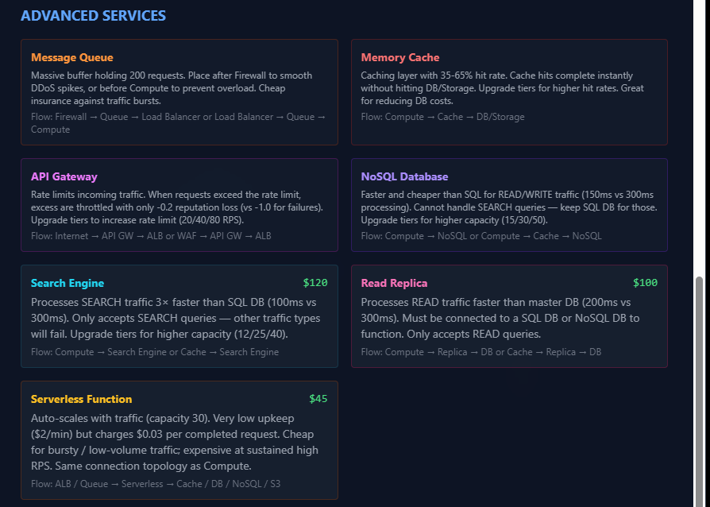

2) **Tipos de tráfico.**

| Tipo de tráfico | Ejemplo real | Componente recomendado para procesarlo | Riesgo si se procesa incorrectamente |
| :--- | :--- | :--- | :--- |
| **STATIC** | El logo de la página, los archivos CSS o el código JavaScript del frontend. Son cosas pesadas pero que son exactamente iguales para todos los usuarios. | CDN en la frontera de la red, sacando los datos de un nodo de Storage (S3). | Se desperdician recursos críticos. Si ponemos al servidor principal a enviar imágenes de 5MB por cada conexión TCP, se van a mantener ocupados los hilos de ejecución y los sockets sólo mandando bytes que no aportan nada realmente a la lógica de negocio, dejando sin espacio a las transacciones reales. |
| **READ** | Un GET a la API para cargar el perfil de un usuario o ver los últimos posteos de un foro. Es información dinámica, pero que muchos usuarios consultan una y otra vez. | Un Cache (tipo memoria RAM) en el medio y, si el dato no está ahí, consultar a una Réplica de lectura. | Saturamos la base de datos principal. Si mandamos todas las lecturas directo al nodo principal, la sobrecargamos. Las bases relacionales bloquean recursos (locks) para asegurar consistencia y si la saturamos a puras lecturas, las escrituras se traban y el rendimiento de todo el sistema disminuye. |
| **WRITE** | Un POST procesando un pago, o un PUT actualizando una contraseña. Son datos críticos de estado que sí o sí tienen que quedar guardados y confirmados. | El Compute ejecutando la lógica de negocio y escribiendo directo (sin intermediarios) en la SQL DB o NoSQL. | Nos arriesgamos a perder información vital. Si metemos un caché en el medio de una escritura y el nodo pierde energía antes de volcar a disco, perdemos transacciones en el aire y corrompemos la consistencia del sistema. Siempre debemos mandar las escrituras al almacenamiento persistente. |
| **UPLOAD** | Un usuario subiendo un archivo pesado, como un PDF, una imagen o un video desde su teléfono. | El Compute recibiendo la carga de red, validándola y guardándola directo en un Storage externo. | Rompemos la escalabilidad horizontal. Si guardamos esos archivos en el disco duro local de nuestro servidor de cómputo, cuando ese servidor se apague o lo reiniciemos, el archivo desaparece. Además, al procesar la subida localmente mantenemos las conexiones TCP abiertas mucho tiempo, agotando nuestros descriptores de archivos. |
| **SEARCH** | Un usuario escribiendo en una barra de búsqueda y esperando que el sistema le devuelva resultados y filtros en milisegundos. | Un Search Engine dedicado que trabaje internamente con índices invertidos. | Destruimos el rendimiento del motor relacional. Si hacemos un LIKE %atributo% en una base de datos normal, generamos un escaneo secuencial masivo de toda la tabla. Esto nos consume toda la CPU y la RAM de la base, tirando abajo el servicio para el resto de los usuarios. |
| **MALICIOUS** | Una botnet haciéndonos un SYN flood o mandándonos peticiones basura para voltear el sistema. | Un Firewall posicionado bien al frente de todo el perímetro de la red. | Dejamos que el sistema colapse solo. Si permitimos que esos paquetes lleguen a nuestros servidores, el sistema operativo va a intentar asignarles recursos (memoria, sockets, hilos) a peticiones que son pura basura. Nos quedamos sin recursos de red al instante y nuestros usuarios reales van a empezar a recibir Timeouts o conexiones rechazadas. |

Para el tipo de tráfico STATIC en la siguiente captura podemos apreciar que si tenemos un CDN, el trafico no pasa por el compute. Sino que primero va hacia el CDN y luego al storage directamente.

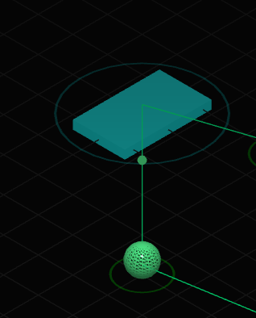

Adjuntamos una captura sobre la explicacion del tipo de trafico que da el juego:

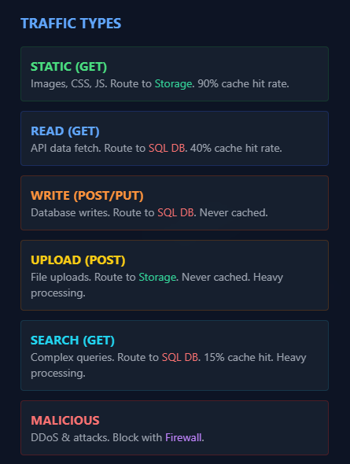

3) **Testeamos las Queues.**

Teniendo esta arquitectura:

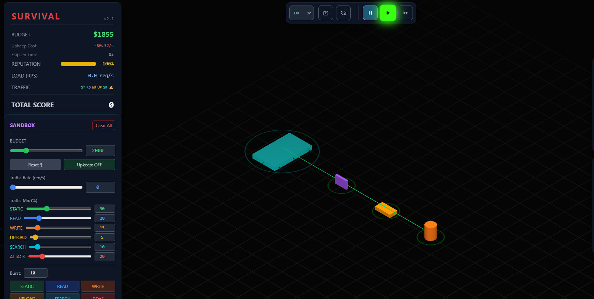

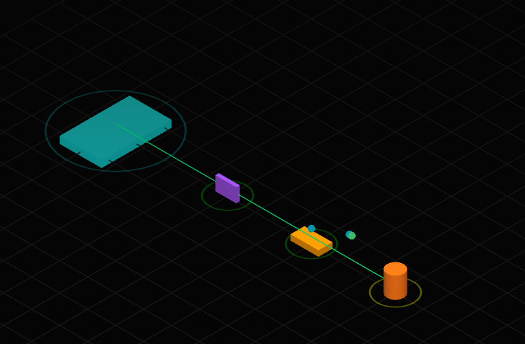

Durante la simulación, al incrementar súbitamente el throughput, observamos que la Queue actúa como un buffer de absorción, lo que significa que en lugar de saturar el nodo de computación y provocar la caída de conexiones, la Queue retiene el excedente de peticiones, entregándolas al nodo Compute a un ritmo más bajo que el nodo puede soportar. Después, al reducir el tráfico entrante a cero de forma repentina, notamos que el procesamiento no se detiene sino que el nodo de computación continúa trabajando, vaciando de manera progresiva los mensajes almacenados en la Queue de forma asíncrona. 

Podemos decir que esto demuestra cómo la implementación de colas nos permite desacoplar la recepción de peticiones del procesamiento, protegiendo la infraestructura ante picos (bursts) anómalos sin perder datos.

4) **Primera infraestructura mínima.**

Primero viendo cada uno de los requisitos pensamos que los componentes que solucionan lo que se pide son:

- Tráfico estático y uploads = El storage.

- Lecturas y escrituras de datos = Una base de datos SQL y para ayudarla una caché.

- Búsquedas = Un motor de búsquedas.

- Ataques o tráfico malicioso = Un firewall que en realidad es lo que nunca debe faltar y es lo primero que debemos pensar.

Obviamente para manejar la lógica necesitamos un nodo de cómputo y ademas un balanceador de carga (tambien nos ayudamos completando los primeros niveles del modo campaña). Con respecto al balanceador de carga, habíamos pensado en obviarlo porque íbamos a usar un solo nodo compute pero el mismo juego no nos dejaba conectar el firewall directo al nodo de cómputo.

El resultado de lo que obtuvimos fue:

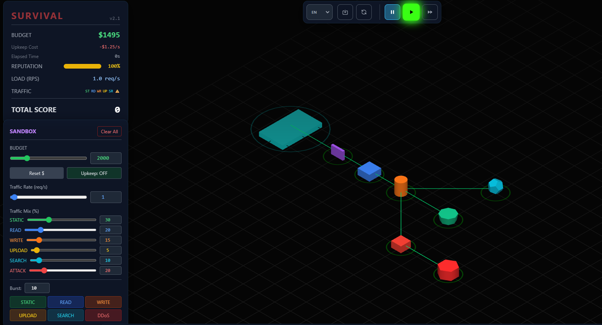

El presupuesto inicial era de $2000 dólares, e inicialmente el estado de salud de todos los componentes es del 100%.

Al modificar el traffic rate, claramente nos dimos cuenta de que el nodo de cómputo estaba saturado constantemente. Al inicio no lo pensamos y creímos que con uno solo sería suficiente, lo cual resultó ser un grave error. 

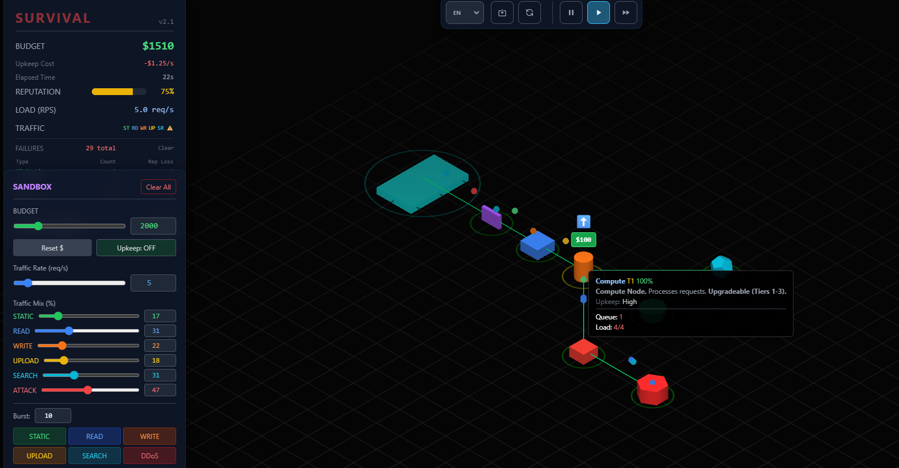

Luego de seguir investigando un poco mas porque falló tan rapido (traffic rate de 5 req/s) logramos concluir que aunque el Firewall filtró los ataques correctamente y el Caché alivió las lecturas de la base de datos, el nodo de Compute tuvo que gestionar y mantener abierta cada conexión TCP de los usuarios. Al hacer que el tráfico STATIC pase por el servidor principal en lugar de usar un CDN (como luego nos dimos cuenta que dice la campaña), obligamos al Compute a gastar sus hilos de ejecución (threads) en transferir archivos pesados hacia el Storage. Al incrementar el throughput en la simulación, las peticiones concurrentes superaron rápidamente el límite del servidor, saturando sus sockets y provocando que rechace las conexiones.

Fue fundamentalmente un problema de diseño que derivó rapidamente en un colapso de capacidad. Al no desacoplar las distintas cargas, generamos un cuello de botella muy rápido en el nodo de cómputo.

5) **Escalabilidad y balanceo**

La primer estrategia que vamos a probar es aumentar la capacidad de cómputo agregando más nodos. Y el load balancer es el que va a distribuir la carga entre los 3 nodos.

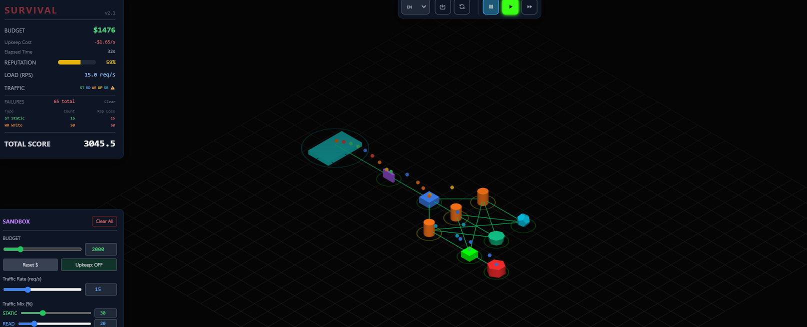

Aquí notamos el tipo de tráfico que mas se perdió fué el de WR-write. Básicamente, aunque triplicamos la cantidad de nodos de cómputo la cantidad de nodos de bases de datos sql que, además de no ser la mas rapida para operaciones de lectura/escritura, se mantuvo constante. He ahí el principal problema. En este caso escalar solo en el sentido de aumentar la cantidad de nodos de cómputo mejora un poco la situación pero no es escalable de ninguna manera, en esta primera modificación el problema sigue siendo totalmente estructural.

Ahora en adición a incrementar la capacidad de cómputo agregaremos mas caché y separaremos los servicios por el tipo de tráfico. Hacemos esto usando los componentes que son superiores en velocidad y asi evitamos que la base de datos sql haga todo aunque sea lento.

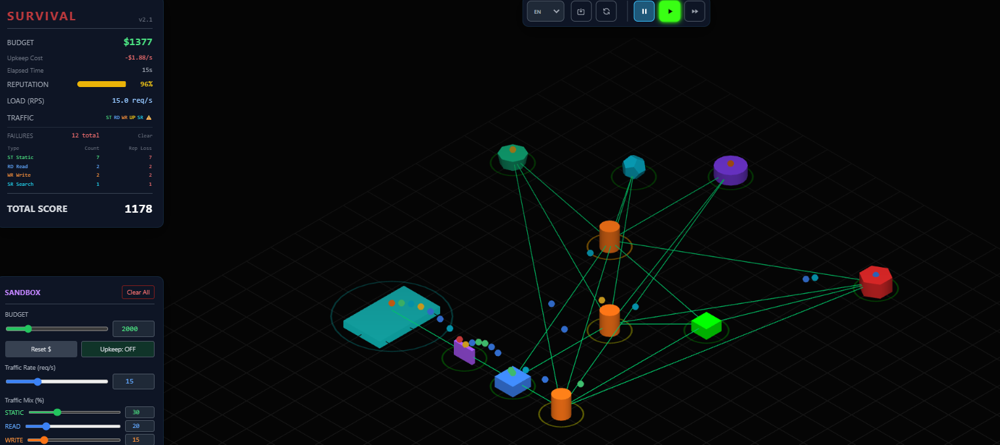

Aun aquí vemos que los nodos no pueden soportar el tráfico, por lo que los vamos a upgradear para que aumente su capacidad de carga. Con el upgrade conseguimos una mejora notable. Vale notar que perdemos tráfico STATIC porque no tenemos un CDN en la arquitectura. El tráfico STATIC pasa por el Compute antes de llegar al Storage, saturando innecesariamente los nodos de cómputo con requests que podrían resolverse directamente desde el borde sin tocar el backend.

Pero con esta arquitectura vemos que sí escalaría horizontalmente, porque cada componente tiene una responsabilidad específica según el tipo de tráfico, es decir que agregar más nodos Compute, más réplicas de NoSQL o más instancias de Search no afecta a los demás servicios, lo que permite escalar cada capa de forma independiente según cuál sea el cuello de botella en cada momento.

6) **Sobrevivir**

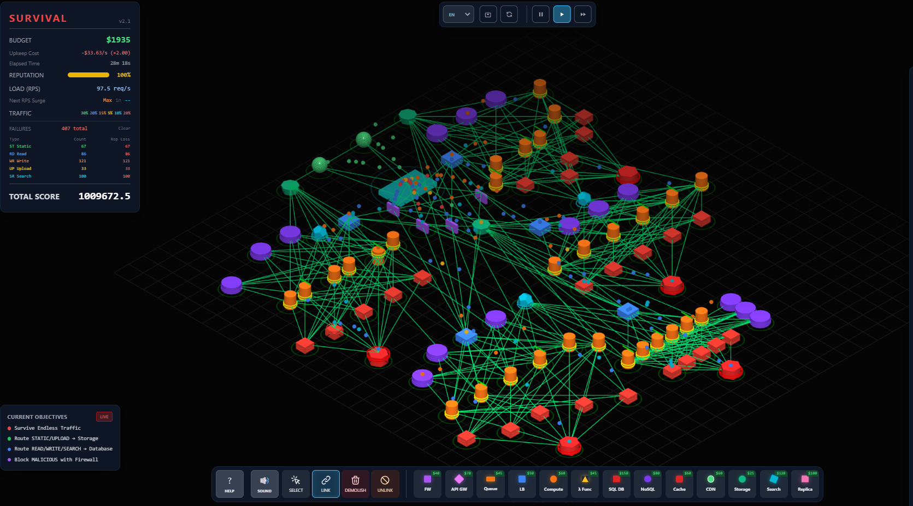

Lo primero que aprendimos es que arrancar con todo desde el inicio no funciona, el upkeep te come el budget antes de que generemos ingresos suficientes. La estrategia que terminó funcionando fue empezar simple e ir agregando componentes a medida que el sistema los pedía.

Los componentes que usamos y por qué los elegimos:
- **Firewall (WAF):** el primero en la cadena, imprescindible para bloquear todo el tráfico MALICIOUS antes de que entre al sistema y dañe la reputación.
- **Load Balancer (ALB):** distribuye el tráfico entre los nodos de Compute con round-robin, sin él un solo Compute recibe todo y se satura rápido.
- **Compute:** el corazón de la arquitectura, procesa todos los requests y los rutea al destino correcto según el tipo de tráfico.
- **SQL DB:** destino principal para tráfico READ, WRITE y SEARCH. Fue el primer cuello de botella que apareció, cuando el tráfico creció, el SQL era el que primero se ponía rojo porque recibía todo.
- **Cache:** agregada cuando el READ empezó a saturar el SQL. Intercepta los READ repetidos y evita que lleguen a la base de datos, reduciendo muchísimo la carga.
- **NoSQL:** sumada cuando los WRITE seguían saturando el SQL incluso con Cache. El Compute automáticamente manda los WRITE al NoSQL, que es más rápido para ese tipo de operación.
- **Storage:** para atender el tráfico UPLOAD y STATIC sin que pase por el SQL ni el Compute más de lo necesario.
- **CDN:** conectado directamente al Storage durante toda la partida, se encargó de servir el tráfico STATIC desde el borde sin tocar el backend, reduciendo la carga en los Computes.
- **Search Engine:** agregado cuando el tráfico SEARCH empezó a fallar. Más eficiente que dejar que el SQL maneje esas consultas.

Lo mas importante y aunque evidente fue aprender a leer bien y a poner pause/continue dependiendo del tipo de ataque que llegaba, cuando un nodo empezaba a mostrarse rojo o cuando el panel de failures mostraba que un tipo de tráfico específico estaba subiendo, ahí pausábamos y agregábamos exactamente lo que hacía falta. UPLOAD fallando → Storage. SEARCH fallando → Search Engine. READ saturado → upgrade de Cache. Luego veíamos si debíamos mantenerlo o quitarlo.

Con el tema de los spikes o picos de datos, al principio las técnicas que usábamos era agregar una queue pero realmente para nosotros fue muy difícil de manejar porque si la dejábamos mucho tiempo como son demasiado lentas, bajaba muchísimo la reputación y terminábamos perdiendo mucho más rápido. Decidimos no usarlos y simplemente agregar más módulos de nodos de Compute cuando hacía falta.

También aprendimos que siempre conviene upgradear un nodo antes de agregar uno nuevo, porque cada nodo nuevo suma upkeep fijo. Y ante eventos como el Cloud Cost Spike, la respuesta fue sacar temporalmente lo más caro y menos crítico para no quedarse sin budget. Generalmente lo que menos subía salvo por ciertas cosas eran los Search.

Si tuviéramos más presupuesto, escalaríamos principalmente los nodos de Compute y la Cache, que fueron los que más veces necesitamos upgradear a lo largo de la partida.

Con esa misma lógica escalamos la arquitectura de manera horizontal y creemos que si queríamos podríamos haber seguido mucho más.

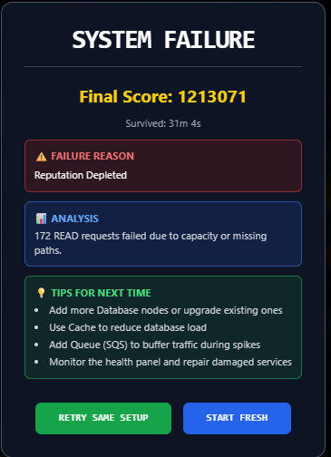
